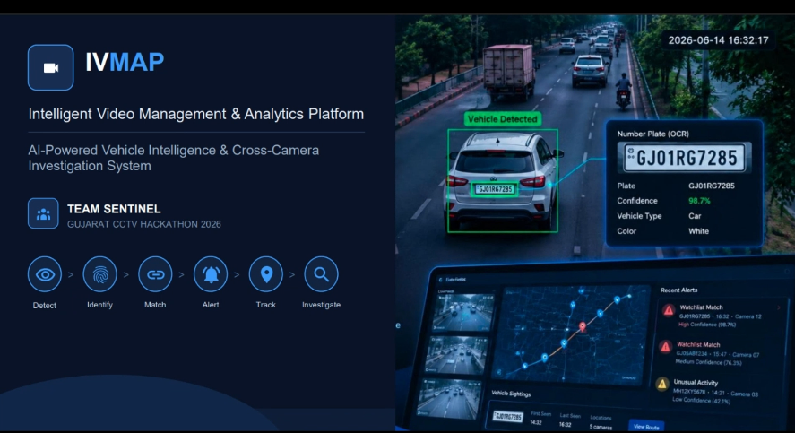
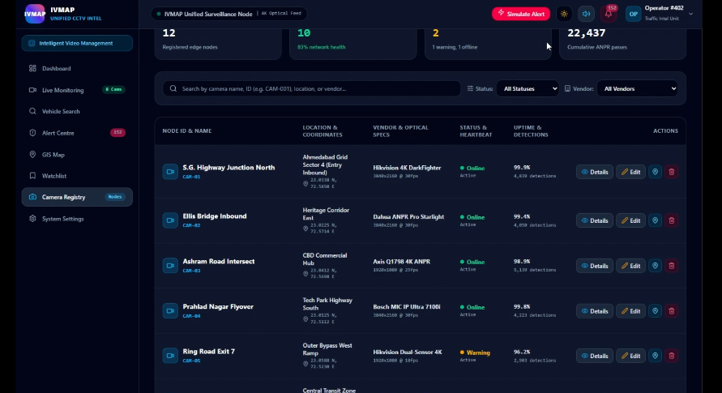
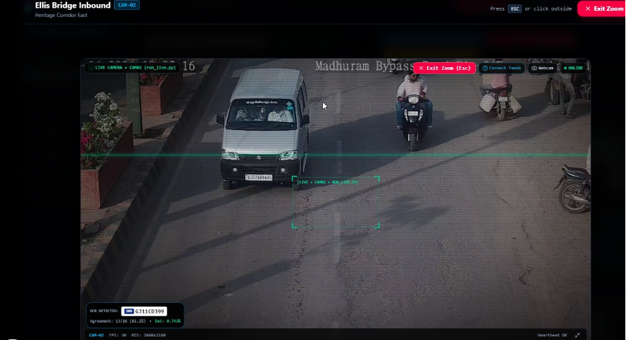
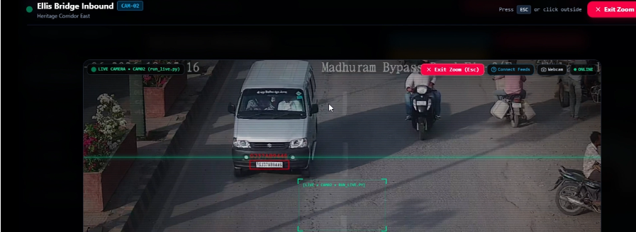
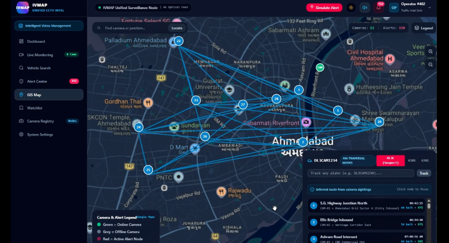
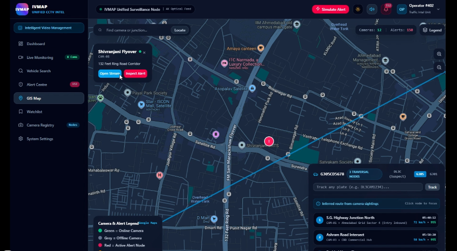
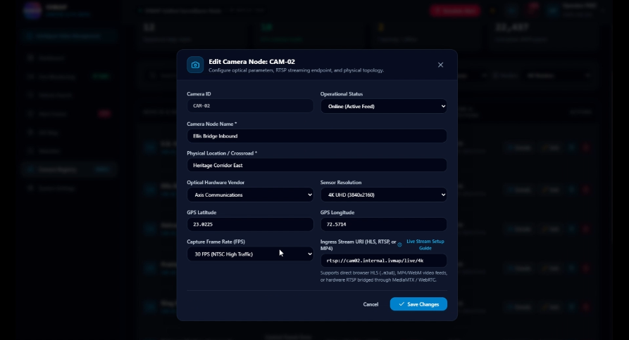
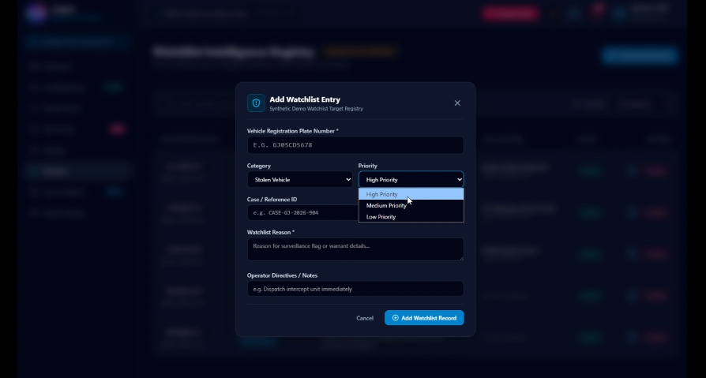
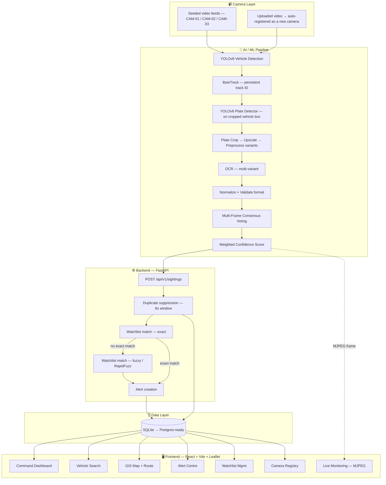
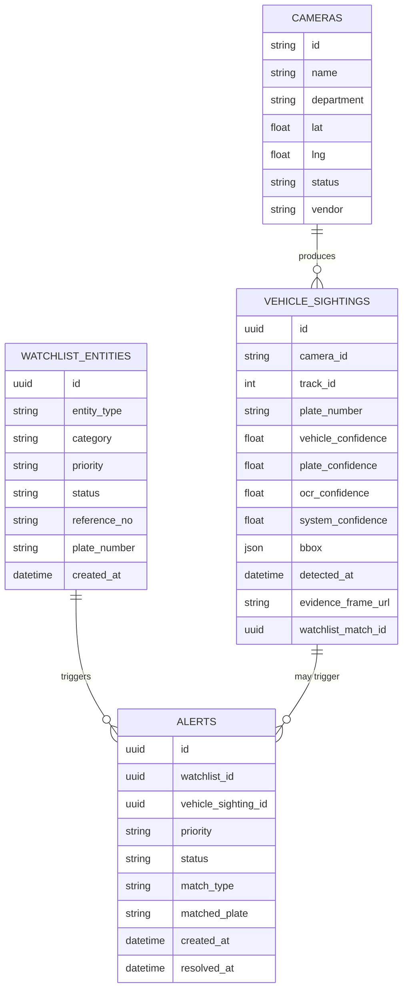

<div align="center">



# 🛰️ IVMAP
### Intelligent Video Management & Analytics Platform

**AI-Powered Vehicle Intelligence & Cross-Camera Investigation System**

*Built by Team Sentinel — Gujarat CCTV Hackathon 2026*

<p align="center">
  
  
  
  
  
  
  
</p>

<p align="center">
  <b>Detect</b> → <b>Identify</b> → <b>Match</b> → <b>Alert</b> → <b>Track</b> → <b>Visualise</b> → <b>Investigate</b>
</p>

</div>

---

## 📋 Table of Contents

<details>
<summary>Click to expand</summary>

- [🔥 Why We Built This](#-why-we-built-this)
- [✨ Features](#-features)
- [🖼️ Screenshots](#️-screenshots)
- [🏗️ System Architecture](#️-system-architecture)
- [🧠 The AI / ANPR Pipeline](#-the-ai--anpr-pipeline)
- [🛠️ Tech Stack](#️-tech-stack)
- [🗄️ Database Schema](#️-database-schema)
- [🔌 API Reference](#-api-reference)
- [📁 Repository Structure](#-repository-structure)
- [⚡ Getting Started](#-getting-started)
- [🎬 Demo Story](#-demo-story)
- [🔐 Security](#-security)
- [🌐 Scalability — 50 → 80,000 Cameras](#-scalability--50--80000-cameras)
- [🧩 Engineering Challenges We Actually Hit](#-engineering-challenges-we-actually-hit)
- [🚧 Honest Scope — What's Real vs. What's Future Work](#-honest-scope--whats-real-vs-whats-future-work)
- [👥 Team Sentinel](#-team-sentinel)
- [📄 License](#-license)

</details>

---

## 🔥 Why We Built This

<table>
<tr>
<td width="50%">

### The Problem

Gujarat's **26 government departments** operate CCTV infrastructure independently, across heterogeneous vendor hardware (Hikvision, Dahua, CP Plus, and others), with **no shared layer** for cross-department vehicle identification, watchlist matching, or state-wide visualisation.

An officer investigating a vehicle today has no single system that can answer:

> *"Where has this vehicle been seen, across which cameras, and is it flagged?"*

At state scale this is a **~80,000-camera** problem — and centralising raw video from all of them is a bandwidth and GPU-cost catastrophe.

</td>
<td width="50%">

### What IVMAP Does

IVMAP is a hybrid, **metadata-first** CCTV analytics platform that proves the full mandatory evaluation story end-to-end, on real inference, across multiple simulated camera feeds:

- ✅ **Real YOLOv8** vehicle detection + tracking (ByteTrack)
- ✅ **Dedicated license-plate detector** — not a "lower-half-of-car" heuristic
- ✅ **OCR + multi-frame consensus voting**, not a single guess
- ✅ **Fuzzy watchlist matching** (RapidFuzz) with OCR-confusion awareness
- ✅ **Live** camera workers (MJPEG), not a one-shot batch script
- ✅ **Cross-camera route reconstruction** on a live GIS map
- ✅ Honest, **confidence-scored** output — never a claim of perfect recognition

</td>
</tr>
</table>

---

## ✨ Features

| Feature | Description | Component |
|---|---|---|
| 🚗 **Vehicle Detection & Tracking** | YOLOv8 detects cars/motorcycles/buses/trucks per frame; ByteTrack assigns a persistent track ID so one vehicle isn't logged as 100 separate rows | `ai/detection/vehicle_detector.py` |
| 🔍 **Dedicated Plate Detection** | A second YOLO pass, run only on the *cropped vehicle box*, finds the actual plate region — replacing an earlier "lower 50% of the car" heuristic | `ai/detection/plate_detector.py`, `license_plate_detector.pt` |
| 🔡 **ANPR / OCR** | Plate crop → upscale → multi-variant preprocessing (original / CLAHE / grayscale) → OCR → best candidate | `ai/ocr/ocr_engine.py`, `ai/ocr/plate_parser.py` |
| 🗳️ **Multi-Frame Consensus Voting** | A single frame's OCR reading drifts (`3` vs `J`); readings across a vehicle's full track are edit-distance-clustered and majority-voted into one final plate | `PlateAggregator` (rapidfuzz-based) |
| 🧮 **Weighted Confidence Scoring** | `0.25×vehicle_conf + 0.35×plate_conf + 0.40×ocr_conf` — a single defensible "system confidence," never presented as ground truth | `ai/utils/confidence.py` |
| 🎯 **Plate Format Validation** | Rejects garbage strings before they ever reach the watchlist, without over-fitting to one rigid regex | `ai/utils/normalization.py` |
| 🚨 **Watchlist Matching — Exact + Fuzzy** | Exact normalised-plate lookup first; on a miss, a Levenshtein/character-confusion-aware fuzzy pass surfaces a **"possible match — verify"** tier instead of auto-trusting a near-miss OCR read | FastAPI backend + RapidFuzz |
| 📡 **Live Camera Workers** | Each camera runs as its own background thread, looping its source video like a real feed never runs out of footage, pushing annotated frames into an MJPEG stream | `run_live.py`, `frame_store.py`, `stream_server.py`, `worker_manager.py` |
| 🗺️ **Cross-Camera Route Reconstruction** | Every sighting keeps its `camera_id`; a searched plate's full, time-ordered sighting history is drawn as a route across camera markers on a live GIS map | Vehicle Search + GIS Map screens |
| 🔔 **Real-Time Alert Centre** | A watchlist match creates an alert instantly, colour-coded by priority, with acknowledge/resolve actions | Alert Centre screen |
| 🎥 **Evidence Frames** | Every finalized sighting keeps its annotated evidence frame (bounding box + OCR overlay) for operator verification | ANPR evidence pipeline |
| 🖥️ **Camera Registry** | Full CRUD over camera nodes — vendor, resolution, FPS, RTSP/HLS ingress URI, GPS coordinates, live status | Camera Registry screen |

---

## 🖼️ Screenshots

### 🏠 Command Dashboard & Live Pipeline
System-wide KPIs (registered cameras, network health, active alerts, cumulative ANPR passes) alongside the actual terminal output of the live inference workers — the numbers on screen come from real detections, not mock data.



---

### 📹 Live Monitoring — Real-Time OCR Overlay
Each camera feed is annotated live with its detection box, an OCR read (with agreement %), and heartbeat/FPS telemetry, mirroring exactly what a real Live Monitoring grid would show from an RTSP feed.

<table>
<tr>
<td width="50%"></td>
<td width="50%"></td>
</tr>
<tr>
<td align="center"><i>OCR reading <code>GJ11CD399</code> live from CAM-02</i></td>
<td align="center"><i>Vehicle tracking box locked on target</i></td>
</tr>
</table>



---

### 🔎 Vehicle Search — Cross-Camera Investigation
Search any plate and get its full, chronological, cross-camera sighting history — first seen, last seen, vehicle type, confidence-scored detections, and evidence — with a one-click watchlist-match callout.


**Actual evidence frame from the pipeline**, plate box drawn directly on the source video frame:



---

### 🗺️ GIS Command Map — Route Reconstruction
Every camera plotted on a live Ahmedabad map; a searched plate's inferred route is drawn across the camera nodes it was seen at, in chronological order, with speed and confidence per hop.

<table>
<tr>
<td width="50%"></td>
<td width="50%"></td>
</tr>
</table>

---

### 📋 Camera Registry
Full fleet visibility — vendor, sensor resolution, FPS, uptime, live detection counts — plus an edit modal for onboarding a new node (RTSP/HLS/MP4 ingress URI, GPS lat/lng, frame rate).




---

### 🚩 Watchlist Management
Seeding and managing the synthetic demo watchlist — plate number, category (stolen / wanted / suspect), priority, case reference, and operator directives.



---

## 🏗️ System Architecture

IVMAP is a **modular monolith**, not microservices — a deliberate choice under a short build window. Every architectural decision trades theoretical elegance for **working, demoable functionality**, while remaining honest about what a state-wide production system would additionally require.



### Architecture layers

| # | Layer | Purpose | Technology (as built) |
|---|---|---|---|
| 1 | Camera | Source video for detection | Pre-recorded/looping video feeds simulating live cameras; upload endpoint for onboarding new ones |
| 2 | AI / ML Pipeline | Detect vehicles, read plates, vote a consensus plate, score confidence | YOLOv8 (vehicle + plate), ByteTrack, OCR engine, RapidFuzz consensus voting |
| 3 | Backend (FastAPI) | Ingest sightings, match watchlist (exact + fuzzy), raise alerts, serve query APIs | Python, FastAPI, SQLAlchemy, RapidFuzz |
| 4 | Data Layer | Single source of truth | SQLite (MVP), Postgres-ready via env-driven URL |
| 5 | Frontend | Command-centre operator UI | React, Vite, TypeScript, Tailwind, Leaflet |

### Why this shape

- **One backend language, not two** — removes an entire class of integration bugs under deadline pressure.
- **No message broker (Redis/Kafka) at this scale** — the backend writes detections straight to the database; a broker is a scale-up concern, not an MVP need.
- **No live RTSP/ONVIF against real department hardware yet** — but a video, once uploaded, is treated as a *continuous live source* through the exact code path a real stream would use.
- **Polling over WebSockets for v1** — the dashboard refreshes every few seconds via REST; functionally identical in a live demo, far less to get wrong.
- **Every sighting keeps its `camera_id`, end to end** — this is what makes cross-camera correlation possible at all.

---

## 🧠 The AI / ANPR Pipeline

This is the part of the project that changed the most — and honestly, it's the part worth explaining, because the *first* version had a real flaw we caught and fixed before it reached the judges.

### ❌ What we started with

```
YOLO detects CAR
      ↓
Take the LOWER HALF of the car's bounding box
      ↓
Hand that entire crop to OCR
      ↓
OCR finds ANY text-like thing
      ↓
"CAR048", "CAR078", "CAR058" ...
```

This is a geometry heuristic, not plate detection — it assumes the plate is always in the bottom half of every vehicle box. It "worked" often enough to look convincing, but it was fundamentally not ANPR: it was OCR reading random parts of a car and getting lucky. Worse, our own seed watchlist had a synthetic `CAR048` entry that this heuristic could accidentally "match," producing a *technically real but semantically fake* watchlist alert.

### ✅ What we corrected it to

```
CCTV FRAME
    ↓
YOLOv8 Vehicle Detector  ──▶  vehicle bbox + track ID (ByteTrack)
    ↓
Crop the vehicle only
    ↓
YOLOv8 Plate Detector    ──▶  the ACTUAL plate bounding box
    ↓
Convert plate coords back to full-frame coords
    ↓
Crop ONLY the plate
    ↓
Preprocess (upscale 3–4×, grayscale, CLAHE, denoise) — multiple variants
    ↓
OCR each variant, keep the strongest valid reading
    ↓
Normalize (strip separators, uppercase)
    ↓
Validate against a plate-format sanity filter
    ↓
Multi-frame consensus voting (per track ID, fuzzy-clustered)
    ↓
Weighted confidence score (vehicle × plate × OCR)
    ↓
POST finalized sighting → Backend
```

**Why this matters:** a dedicated plate detector run on the cropped vehicle (not the whole 1920×1080 frame) dramatically reduces the search area and means OCR only ever sees an actual license plate — not a bumper, a road surface, or a windshield reflection.

### Multi-frame consensus, in practice

A vehicle stays in frame for several seconds — at 5–10 sampled frames, one OCR pass is not treated as truth:

```
Frame 101 → DL3CAM123   0.42
Frame 102 → DL3CAM1234  0.71
Frame 103 → DL3CXM1234  0.48
Frame 104 → DL3CAM1234  0.79
Frame 105 → DL3CAM1234  0.83
Frame 106 → DL3CAM1234  0.76
                ↓
     edit-distance clustering
                ↓
      FINAL = DL3CAM1234  (4/6 agreement, high confidence)
```

### Watchlist matching helps OCR, not just receives it

If a plate doesn't get an *exact* watchlist hit, it isn't discarded — it's fuzzy-matched (Levenshtein distance, with common OCR-confusion pairs like `0↔O`, `1↔I`, `5↔S`, `8↔B`, `3↔J` normalised **only at comparison time, never blindly at OCR time**):

```
OCR result:        GJ05CD56B8
Watchlist entry:   GJ05CD5678
                        ↓
        Levenshtein distance after confusion-normalisation = 1
                        ↓
              ⚠ POSSIBLE MATCH — 94% similarity
                        ↓
        Surfaced to the operator as "verify", never auto-confirmed
```

This is the difference between an honest, defensible ANPR system and one that silently pretends its OCR is perfect.

### Confidence is a system score, not a probability of truth

```python
score = (
    0.25 * vehicle_confidence +
    0.35 * plate_confidence   +
    0.40 * ocr_confidence
)
```

We deliberately weight OCR and plate-detection confidence higher than vehicle-classification confidence, because those two are what actually matter for ANPR — and we call it a **system confidence score**, never "probability the plate is correct."

### Going live: from batch script to a running camera

The pipeline didn't stay a one-shot `run_video.py` that only reports results after the whole file finishes. `run_live.py` turns each camera into its own background worker:

- A video file is **looped continuously** — a real camera never runs out of footage.
- A vehicle's track is **finalized and POSTed the moment it goes idle** (~4 seconds without a new reading) — not at the end of the file — so alerts appear *while the camera is still running*.
- A **forced-send safety valve** finalizes any track still active after ~24 seconds, so a parked vehicle can't be tracked forever without ever being reported.
- A **45-second, fuzzy-matched cooldown** per plate/camera stops a short looping demo clip from flooding the sightings table every cycle.
- Every processed, annotated frame is pushed into a shared frame store, exposed as an MJPEG stream (`GET /live/{camera_id}`) — this is what a real Live Monitoring grid consumes.

---

## 🛠️ Tech Stack

| Layer | Technology | Why |
|---|---|---|
| **Vehicle Detection** | YOLOv8 (Ultralytics, nano/small) | CPU-friendly if no GPU is available on demo day |
| **Plate Detection** | Dedicated YOLOv8 license-plate model (`license_plate_detector.pt`) | Purpose-trained on plate regions — not a repurposed COCO model |
| **Tracking** | ByteTrack (IoU-based) | Prevents double-counting the same vehicle across frames |
| **OCR** | EasyOCR / fast-plate-ocr (ONNX) | Trained on plate-style text; runs acceptably on CPU |
| **Multi-frame Consensus** | RapidFuzz (edit-distance clustering) | A single frame's OCR reading drifts — voting corrects one-off misreads |
| **Watchlist Fuzzy Matching** | RapidFuzz (Levenshtein distance) | Catches near-miss OCR reads without auto-trusting them |
| **Backend API** | Python + FastAPI | One backend language; hosts the API and calls into the AI pipeline in-process |
| **ORM / DB** | SQLAlchemy + SQLite (Postgres-ready) | Zero-ops for a demo; same schema scales up later |
| **Frontend** | React + Vite + TypeScript | Fast dev loop, type safety |
| **Styling / UI** | Tailwind CSS + Shadcn/ui | Production-grade look with near-zero design time |
| **Maps / GIS** | Leaflet | Lightweight, sufficient for markers + route polylines |
| **Live Video Server** | Custom MJPEG stream server (`stream_server.py`) | Continuous per-camera live feed without RTSP/ONVIF complexity |
| **Runtime** | Node.js/TS server (`server.ts`) + Python AI/backend | TS handles the frontend serving layer; Python owns inference + API |

---

## 🗄️ Database Schema

Four tables carry the entire MVP — every sighting and alert links back to its source camera and matched watchlist entry, which is what makes cross-camera route reconstruction and watchlist correlation possible.



**Design notes:**
- `alerts.status` (`new` / `acknowledged` / `resolved`) is deliberately a separate field from `watchlist_entities.category` (`stolen` / `wanted` / …) — one answers *"what kind of flag is this?"*, the other *"has an operator dealt with it?"*.
- `alerts` denormalises `camera_name`, `plate_number`, and `category` at creation time, so the Alert Centre and GIS screens don't need an extra join per row.
- A vehicle's **route** is simply every `vehicle_sighting` for one normalised plate, ordered by `detected_at` across cameras, with same-camera repeats inside a short window collapsed into one point.
- Primary keys are UUID strings throughout, matching the frontend's TypeScript types.

---

## 🔌 API Reference

### Ingestion (AI → Backend)

| Method | Endpoint | Purpose |
|---|---|---|
| `POST` | `/api/v1/sightings` | AI pipeline posts one finalized sighting; backend normalises the plate, suppresses duplicates within 8 seconds, checks the watchlist (exact → fuzzy), and creates an alert on a match |

### Query (Backend → Dashboard)

| Method | Endpoint | Purpose |
|---|---|---|
| `GET` | `/api/dashboard/summary` | KPI counts for the Command Dashboard |
| `GET` | `/api/cameras`, `/api/cameras/status` | Camera registry and live status |
| `GET` | `/api/alerts` | List alerts, filterable by priority/status |
| `PATCH` | `/api/alerts/{id}` | Acknowledge / resolve an alert |
| `GET` | `/api/vehicles/{plate}/sightings` | All sightings for a searched plate |
| `GET` | `/api/vehicles/{plate}/route` | Chronological, cross-camera route for a plate |
| `GET` | `/api/gis/cameras`, `/api/gis/alerts` | GeoJSON-style data for the map |
| `GET` | `/api/watchlist/{id}` | Single watchlist entity detail |
| `GET` | `/api/sightings/{id}` | Single sighting detail |
| `GET` | `/api/health` | Liveness check — backs the dashboard's system-health indicator |

### Live streaming (independent service, not yet wired to the dashboard)

| Method | Endpoint | Purpose |
|---|---|---|
| `GET` | `/live/{camera_id}` | MJPEG live video stream for that camera |
| `GET` | `/live/{camera_id}/snapshot` | Single latest JPEG frame |
| `GET` | `/live/status` | Online/offline status per running camera worker |
| `POST` | `/cameras/upload` | Upload a video file → register as a camera → start live processing, in one call |
| `POST` | `/cameras/{camera_id}/stop` | Stop the live worker for a camera |

---

## 📁 Repository Structure

```text
TIMEPASS/
│
├── ai/                          # AI / computer vision pipeline
│   ├── detection/                 # vehicle_detector.py, plate_detector.py
│   ├── ocr/                       # ocr_engine.py, plate_parser.py
│   ├── tracking/                  # ByteTrack integration
│   ├── pipeline/                  # inference.py — the assembled pipeline
│   └── utils/                     # preprocessing.py, normalization.py, confidence.py
│
├── backend/                     # FastAPI application, DB models, schemas
│
├── data/                        # Sample data, seed watchlist, generated outputs
├── debug_plates/                # Saved plate crops for OCR-quality debugging
├── docs/                        # Architecture docs, diagrams, screenshots
│   └── screenshots/                # ← README image assets live here
│
├── public/                       # Static frontend assets
├── src/                           # React + TypeScript frontend source
│
├── VIDEO1.mp4 / VIDEO2.mp4 / VIDEO3.mp4   # Simulated CCTV camera feeds (CAM-01/02/03)
├── license_plate_detector.pt     # Dedicated plate-detection YOLO weights
├── yolov8n.pt                    # Vehicle-detection YOLO weights
│
├── run_video.py                  # Batch pipeline — process a file, log results
├── run_live.py                   # Live pipeline — continuous per-camera worker
├── server.ts                     # Node/TS server layer
│
├── requirements.txt               # Python dependencies
├── package.json / bun.lock        # Frontend dependencies (bun-managed)
├── vite.config.ts / tsconfig.json # Frontend build config
├── index.html                     # Frontend entry point
│
├── implementation_plan.md         # Internal build plan
├── task.md                        # Task breakdown
├── walkthrough.md                 # Internal walkthrough notes
├── metadata.json
├── .env.example
└── README.md                      # ← you are here
```

> Languages in this repo: **TypeScript** (frontend + server layer) and **Python** (AI pipeline + backend), reflecting the one-backend-language-per-side design in [System Architecture](#️-system-architecture).

---

## ⚡ Getting Started

### Prerequisites

- Python 3.10+
- Node.js / [Bun](https://bun.sh) (frontend uses `bun.lock`)
- A GPU is **optional** — the vehicle/plate models run acceptably on CPU (nano/small YOLOv8 variants)

### 1. Clone the repository

```bash
git clone https://github.com/PARTH-2512/TIMEPASS.git
cd TIMEPASS
```

### 2. Set up the AI + backend (Python)

```bash
python -m venv venv
source venv/bin/activate        # Windows: venv\Scripts\activate

pip install -r requirements.txt
cp .env.example .env            # fill in required values

# Batch mode — process a video file once and log results
python run_video.py

# Live mode — continuous per-camera workers + MJPEG stream server
python run_live.py
```

### 3. Set up the frontend

```bash
bun install        # or: npm install
bun run dev         # or: npm run dev
```

### 4. Open the dashboard

Navigate to the local URL printed by the dev server (typically `http://localhost:3001`) and log in as the demo operator.

---

## 🎬 Demo Story

**"Locate a flagged vehicle across two cameras."**

1. **Command Dashboard** — cameras registered, system healthy, live telemetry.
2. **Live Monitoring** — a vehicle drives through CAM-01; a live bounding box + OCR overlay appears.
3. **ANPR result** — plate read, weighted confidence shown.
4. **Watchlist match fires** — flagged **STOLEN**, priority **CRITICAL**.
5. **Alert Centre** — the new critical alert appears in real time.
6. **Vehicle Search** — operator searches the plate; full cross-camera sighting history populates.
7. **GIS Command Map** — the route draws itself across CAM-01 → CAM-02 in chronological order.
8. **Evidence panel** — click any sighting for its evidence frame, confidence breakdown, and camera name.

> *"This is the same pipeline that scales to 80,000 cameras statewide via edge processing — we've shown detect-to-route on real inference, not a scripted demo."*

---

## 🔐 Security

**Implemented / planned for the MVP**
- JWT-based authentication for the dashboard API
- Input validation on all API request bodies
- CORS restricted to known frontend origins

**Documented for a state-wide production deployment** *(not built in a 5-day hackathon window — stated honestly rather than faked)*
- Role-based access control (admin / operator / viewer), scoped per department
- Encryption at rest for stored evidence and database contents
- Network segmentation — cameras/VMS isolated from the public internet
- Immutable audit logging of every watchlist change and alert resolution
- Documented data-retention policy — only flagged evidence retained long-term

---

## 🌐 Scalability — 50 → 80,000 Cameras

The core strategy is **metadata-first, edge-first**: raw video never travels further than the nearest processing point — only structured detection events (a plate, a timestamp, a confidence score — kilobytes, not megabytes) reach the central system.

| Concern | MVP (today) | State-wide (future) |
|---|---|---|
| Camera ingestion | Recorded/looping video files | Live RTSP/ONVIF per department, via a per-vendor adapter layer |
| AI processing location | Single machine | Regional edge nodes — one pipeline instance per region, replicated |
| Event transport | Direct HTTP POST to backend | Kafka-based event bus once volume exceeds a single backend's comfort zone |
| Database | SQLite, single instance | Partitioned/sharded PostgreSQL, time- and region-partitioned |
| Orchestration | Two processes run directly | Kubernetes, once there are enough regional instances to justify it |

**Bandwidth argument for judges:** centralising raw video from 80,000 cameras at ~2 Mbps each is **~160 Gbps** — infeasible for one site. Centralising only detection *events* (~1–2 KB each, ~1/sec/camera in busy periods) is **~1 Gbps** statewide — three orders of magnitude less, and feasible over a standard government WAN.

Nothing about the MVP's core pipeline needs to be thrown away to reach production scale — it needs to be **replicated per region** and fed by a heavier event bus and a partitioned database, which is exactly why the AI/backend boundary was kept clean from day one.

---

## 🧩 Engineering Challenges We Actually Hit

| Challenge | Root Cause | Fix |
|---|---|---|
| **OCR was reading "CAR048" instead of real plates** | No dedicated plate detector — the pipeline cropped the *lower half of the vehicle box* and OCR'd whatever text-like shape it found there | Added a real YOLOv8 plate detector run on the cropped vehicle box; OCR now only ever sees an actual plate |
| **OCR confusing characters (`3` ↔ `J`, `0` ↔ `O`)** | Single-frame OCR treated as ground truth | Confusion-aware fuzzy watchlist matching (`rapidfuzz.distance.Levenshtein`, `max_distance=1`) plus a `_confusion_normalize()` step applied only at *comparison* time, never blindly at OCR time |
| **Database flooding from looping demo videos** | A short video loop kept re-reporting the same vehicle every cycle | Per-camera in-memory cooldown (45s) with an 85% similarity threshold, layered on top of the backend's own 8-second dedup window |
| **Symmetric character-confusion dictionary caused divergence, not convergence** | Naive bidirectional character mapping | Rebuilt the confusion map to always normalise toward one canonical form |
| **Strict Indian-plate regex silently dropped valid test/foreign plates** | Overfit validation pattern | Defaulted validation to a flexible/generic mode for demo footage, with the strict pattern as an opt-in |
| **`uvicorn --reload` crashing on Windows** | Reload watcher scanning the entire repo, including large video/model files, tripped Windows multiprocessing | Scoped `--reload-dir` to just the application source directory |
| **Frontend showing `Math.random()` detections during early integration** | UI was scaffolded ahead of the real backend being wired in | Explicitly disclosed which screens were live vs. still a UI shell, rather than presenting mocked output as real inference — judged safer than pretending everything was already connected |

**Key engineering principle we kept coming back to:** when an OCR model systematically misreads a character with high confidence, no amount of aggregation-layer cleverness fixes it — the tolerance has to move to the *matching* layer (fuzzy watchlist comparison), not the OCR layer.

---

## 🚧 Honest Scope — What's Real vs. What's Future Work

We'd rather be evaluated on an honest, working pipeline than an impressive-looking fake one.

**✅ Real, running, and demoed on actual inference:**
- YOLOv8 vehicle detection + ByteTrack tracking
- Dedicated plate detection (not a heuristic crop)
- OCR + preprocessing + multi-frame consensus voting
- Weighted confidence scoring
- Exact + fuzzy watchlist matching with alert generation
- Live per-camera workers with MJPEG streaming
- Cross-camera route reconstruction on a GIS map
- Full Vehicle Search, Alert Centre, Camera Registry, Watchlist Management screens

**🔜 Documented as the production path, not built in the hackathon window:**
- Live RTSP/ONVIF integration against real department VMS hardware
- Redis/Kafka event bus, Kubernetes orchestration
- PostGIS-backed spatial queries (currently plain lat/lng columns)
- Full RBAC granularity, immutable audit logging
- The frontend Live Monitoring screen consuming the MJPEG endpoints directly (currently polls REST, same visual result)
- Real VAHAN / eGujCop / AFIS integrations (no MVP-time API access)

---

## 👥 Team Sentinel

| Member | Owns |
|---|---|
| **AI/ML** | Vehicle & plate detection, OCR, tracking, confidence scoring, watchlist-match logic |
| **Backend & Data** | Schema, API, auth, watchlist CRUD, alert logic |
| **Frontend & GIS** | All dashboard screens, Leaflet map, live monitoring UI |
| **Deployment & Docs** | Hosting, demo video, architecture documentation, submission |

All four members were hands-on-keyboard for the full build window — whoever finished a task first naturally picked up integration or documentation work next.

---

## 📄 License

MIT License — see [LICENSE](LICENSE) for details.

<div align="center">

---

*Built for the Gujarat CCTV Hackathon 2026 — proving that a rookie four-person team can ship a genuinely working ANPR pipeline, honestly scoped, in five days.*

**Detect → Identify → Match → Alert → Track → Visualise → Investigate**

</div>
